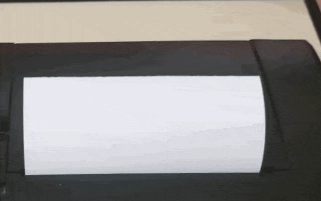

<h1 align="center">Thermal Printer library for arduino/esp32</h1>

# Table of Contents

- [Introduction](#introduction)
- [Quick-start](#quick-start)
- [Features](#features)

<div align="center"></div>

# Introduction

A printout exactly as you planned!
I decided to create a more functional library than the popular Adafruit library.
Less errors, easier start - just use!
I will be grateful for feedback.

Created by BinaryWorlds @2019

Tested on firmware 2.69 and JP-QR701
Some features may not work on the older firmware.

Check the comments in [TPrinter.h](TPrinter.h) and [TPrinter.cpp](TPrinter.cpp) to learn more.

# Quick start

Check examples.

1. Import library:

```
#include "TPrinter.h"
#include <HardwareSerial.h> // or SoftwareSerial
```

2. Set baudrate and pins.

```
const int printerBaudrate = 9600;  // or 19200 usually
const byte rxPin = 16;   // check datasheet of your board
const byte txPin = 17;   // check datasheet of your board
const byte dtrPin = 4;   // if used
```

3. Init

```
HardwareSerial mySerial(1);
Tprinter myPrinter(&mySerial, printerBaudrate);

void setup() {
  micros();
  mySerial.begin(printerBaudrate, SERIAL_8N1, rxPin, txPin);  // must be 8N1 mode
  myPrinter.begin();
}
```

# Features

- [Waiting for end of print process](#waiting-for-end-of-print-process)
- [Change heating parametrs](#change-heating-parametrs)
- [Print bitmap - scalable and centered](#print-bitmap---scalable-and-centered)

## Waiting for end of print process

Mode, choose one:

1. By checking DTR pin
   If enabled and set wrong busyState - print will no start.

```
myPrinter.enableDtr(dtrPin, HIGH);   // pinNR, busyState - default LOW;
```

```
disableDtr(); // disable checking DTR pin
```

2. Calculate print time basing on current heating parametrs (default).
   Fast as DTR(similar time).

```
myPrinter.autoCalculate(true); // false - off
```

3. Set constant time as in Adafruif library (worst option).
   This mode is active, if DTR and autocalculate is disabled.

```
myPrinter.autoCalculate(false);  // turn off default mode

myPrinter.setTimes(30000, 3000);
// oneDotHeight_printTime, default: 30000,
// oneDotHeight_feedTime, default: 3000
// in micros
```

## Change heating parametrs

```
myPrinter.setHeat(1, 224, 40);  // default: 0,255,0 called in begin
```

Best quality: the smallest number of dots burned, the longest heating time

- dots: default 9 (80dots) becouse (9+1)\* 8; units: 8 dots;
- time: default 80 (800 us); units: 10 us
- interval: default 2 (20us); units: 10 us

  (default in printer)

## Print bitmap - scalable and centered

```
printBitmap(*bitmap, width, height, scale = 1, center = true)
```

- bitmap - uint8_t array, each bit in byte - one printed dot(scale 1)
- width of bitmap - must be a multiple of 8
  for example, if you try to print
  [Adarfruit logo](https://github.com/adafruit/Adafruit-Thermal-Printer-Library/blob/master/examples/A_printertest/adalogo.h)
  set width to 80. It's real size of this image. adalogo_data has 750 bytes length.
  80 dots width \* 75 dots height = 6000 dots
  6000 dots / 8 = 750 bytes
  Each line in example have 5 white dots at right side.
  This is because the data is sent in bytes
- height of bitmap - real value, in above example - 75
- scale - default 1, if 0 or greater than the maximum possible scale - the image is printed at it's maximum size
- center - default true


